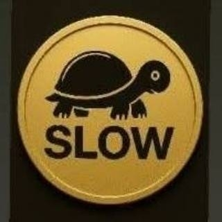

!DOCTYPE html>
<html lang="id">
<head>
  <meta charset="UTF-8">
  <meta name="viewport" content="width=device-width, initial-scale=1.0">
  <title>Koin Slow</title>
  
</head>
<body>
  <header>
    Selamat Datang di Website Koin Slow
  </header>

  <main>
    
    

      
Koin Slow adalah koleksi digital sederhana yang dibuat untuk tampilan menarik dan unik.

      
Website ini bisa dibuka di HP maupun laptop, ringan dan mudah digunakan.

    

  </main>

  <footer>
    &copy; 2025 Koin Slow Project
  </footer>
</body>
</html>
